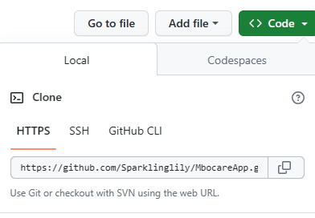
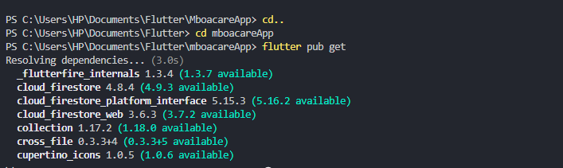
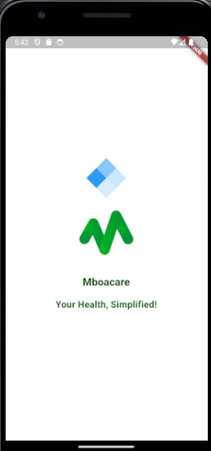

## Getting Familiar with MboaCare Medical App and Steps Taken To Setup the MboaCare Medical App Development Environment.

To successfully run this application on your device , the following must already be set up on your PC: 

1. Github account ✅
2. Vs Code or Android Studio ✅
3. Flutter SDK ✅
4. Git ✅

I already had a GitHub account, VS-Code and Git installed on my computer.

## Steps:

1. Forked the  December 2023 to March 2024" repository and copied the [MboaCare Source code url](https://github.com/AnishaSingh0118/Mboacare) on gitHub.

2. Navigated to my Flutter projects folder on my PC, inside it I created a folder named `MboaCare App`

3. Opened my Vs Code terminal and  typed in `git clone <source code url> ` to clone the repository, then pressed `Enter`.

4. After successfully cloning the project, I inputted the command `cd MboaCare App` to navigate to my present working directory. 
 
 5. Next, I entered `flutter pub get` in the terminal to get/obtain all the dependencies required to successfully run the App on my emulator.

 

 6. Afterwards, I entered command `flutter run` in the terminal to run the app on my android emulator.

 After a successful run, the application launched on my device and I explored it, these were the first screens to come up.

 

 

 

