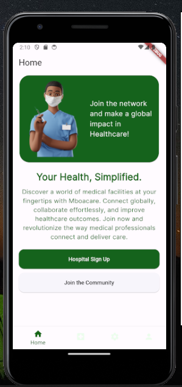

### MboacareApp Test.

**Link** to [Video recording of Mboacare App](https://drive.google.com/file/d/10Pzu6vS3e0PUXhxEpQZ8KG_7jhXv1Tlt/view?usp=sharing)

 **Details on the Device used to run the Mboacare App**

- **Model:** Redmi note 11
- **Processor:** octa-core Qualcomm Snapdragon 680 4G
- **Resolution:** 1080 x 2400
- **RAM:** 4.0GB

### About MboaCare App

  Mboacare App is an Open-Source Mobile Application, that allows users to easily connect and access medical facilities accross the globe. It aims to solve a major pitfall in the health sector, which is information accessiblity on medical facilities and medical experts.
  This application is designed and developed by the Mboalab Community.  

###  Positive Observations/Feedback

  1. Captivating splash screen, as it conveys the core objective of the application.

  2. The search function works efficiently as it displays results to users swiftly, this is an important feature for users, searching for specific medical facilties.

  3.  The filter feature allows  users to seamlessly narrow down search for specific medical facilities. 

  4. The hospital registration form is exhaustive and allows for a smooth user experience.

  5. The colors and fonts used throughout the application are consistent and complimenting.

  6. The **join the community** feature is welcoming and brilliant.

  7. Upon registration and Hospital Sign up, a `Welcome to Mboacare` email is sent to the user.

  8. A confirmation link is sent to the user upon account registration.

  ### Feedback On Features to be Improved Upon

  1. The MboaCare Application, based on documentation allows users to freely and easily access medical facilities around the world. However, the application  does not make provision for end users to sign up/login. Only hospitals can sign up and register their details.

  2.  Inability to sign in via **login with google**  when I tried joining the community, an error snackbar message pops up.

  3. Slow feedback when the **register with google** button is clicked.

  4. Upon clicking the registration button, the third  time after inputting details, I didnt get any feedback or response until seconds later when an error message popped up,about firebase.

  5. After registering an account and filling in hospital details (`Hospital Sign up`). I am navigated to the `Search for Hospital`page to check for existing hospital details. When I close and re-open the application, upon signing in, I am asked to re-input hospital details, THE SECOND TIME, This means the initial form submitted was either not persisted in the database or througout the app.
  6. THE `logout` button is not functional.

  7. The inactive bottom navigation icons are almost invisible, I had to squint my eyes to see the icons.

  8. `Continue with google` button on the `signIn to linkedIn` page is  not functional.

  9. The settings page has an option of choosing the language in which texts on the app is written, a good idea. The default lanuguage for the app is English,however switching to other languages like france and espanol on the app does not affect the texts on other parts of the app except the settings page. 

  After filling in my details on the Hospital Sign Up Page, I didnt get any response, so I closed the application, the next morning I opened the application and then a snack bar showing 'form successfully submitted' popped up, afterwards I was navaigated to the `Connecting Hospitals Globally` page.

  ## Recommendation

  - The inactive bottom navigation icons should be made more visible, for better accessibility of the application. Below is an image of how it looks curerently.

  

  - Auhthentication state should be saved after user sign up.
   
 
  More functionalities should be added to the settings page, such as ;

  - switch theme from light to dark.
  - reset app preferences
  - privacy policy and terms and conditions
  
 
-

  