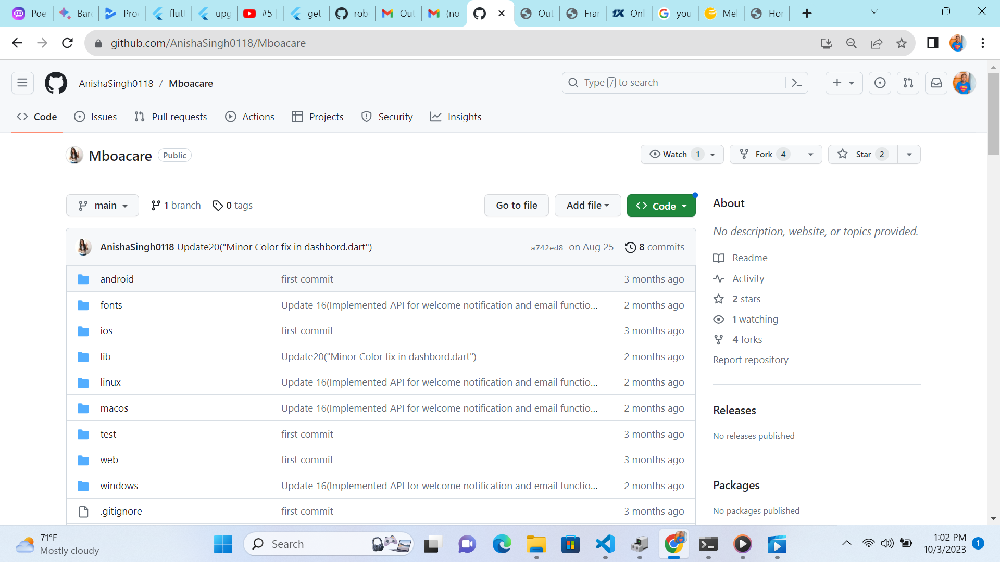
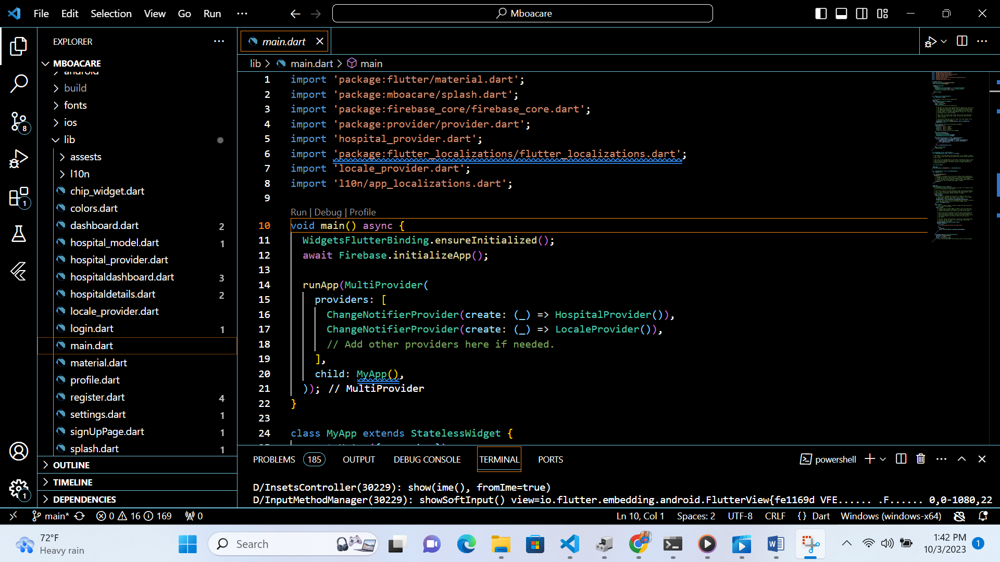
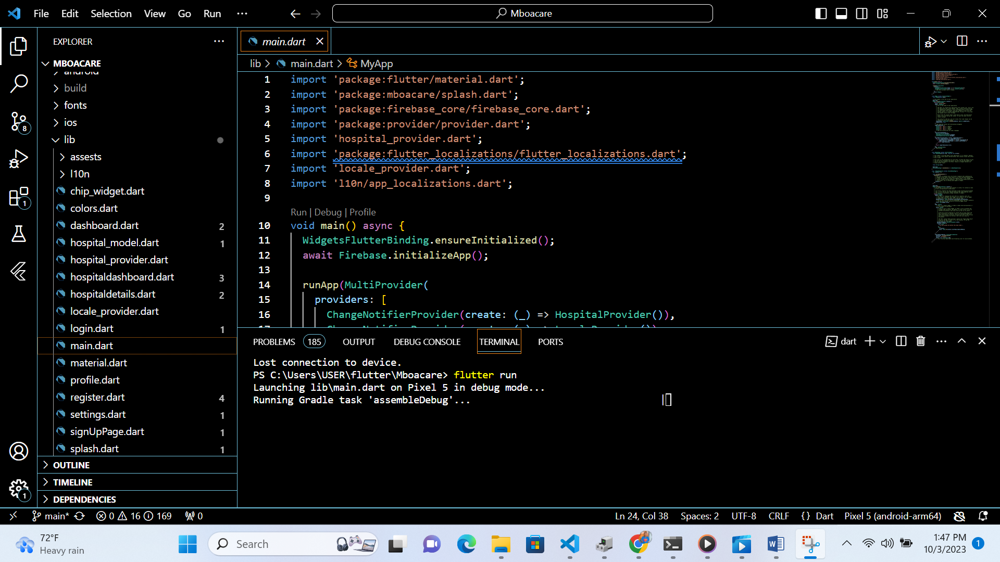
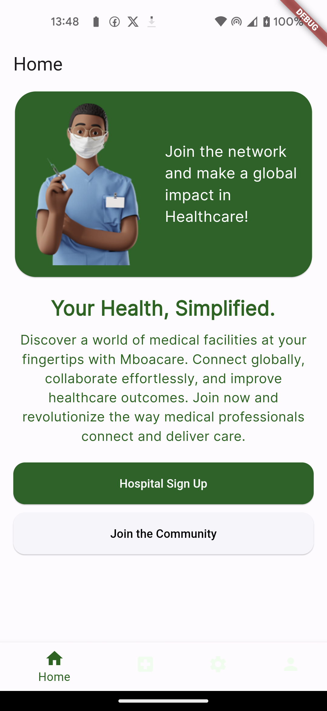
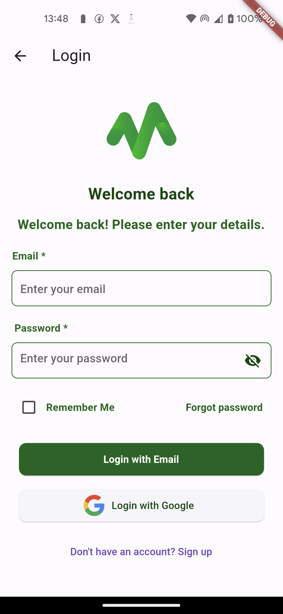
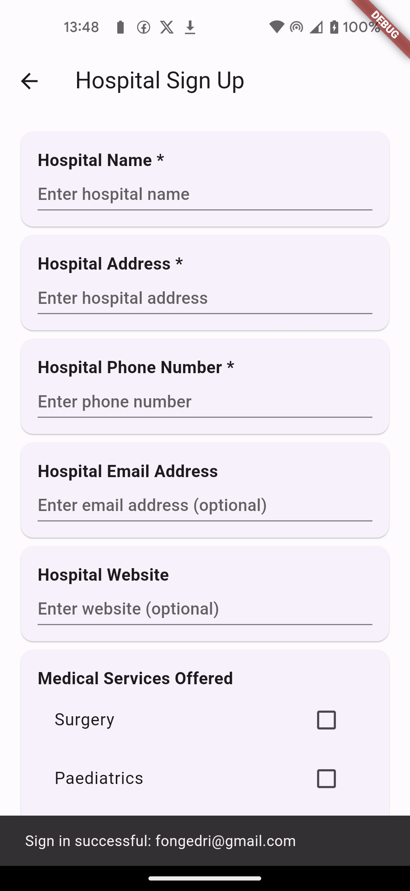
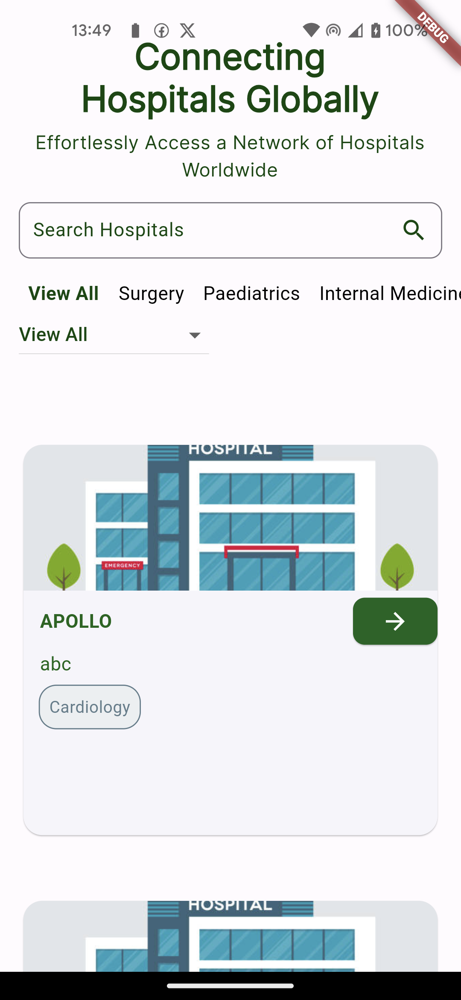

Since I already had a GitHub account and all the other tools set up, I started by forking the "December 2023 to March 2024 Applicants" repository

Steps Taken:
1. Forked the 'December 2023 to March 2024 Applicants' repository
After forking, I cloned it 

I obtained the app's source code from its GitHub repository.

  

  i opened the code on my Vs code.
  
  
 
   I ran 'flutter pub get"  to downoad the depencies.
   i 'ran flutter run' to install the app on my device(mobile phone)
   
    i explored the app on my phone.
    
    
    
    

