# Step by step guide to setting up development environment for Mboacare App

The following are the steps necessary to setup the development environment for Mboacare App on a Windows PC

*Please see this more more visually apealing [documentation site](https://larrytamnjong.github.io/Documentation/mboacaredocs/) which i build using mk docs it has dark and light theme modes plus search functionality and automatic deployment with github pages.*

### Table of Contents
1. Setup a GitHub Account
2. Install Git
3. Install Flutter
4. Install an IDE
5. Clone the "December 2023 to March 2024 Applicants" Repository
6. Clone and Set Up the "Mboacare" Medical App Project
7. Open the Project and Run the project


## 1. Setup a GitHub Account
If you don't already have a Github account, we can create one by following the steps below.
+ Open a web browser and visit [Github](https://github.com/)
+ Click on Sign up
+ Follow the instructions to create and account it involves providing an email address, username and password

## 2. Install Git 
Our next step is to install Git. Git is version control tool that tracks changes to our code files on our computers. 
+ You download git for windows from the [Git Download page](https://git-scm.com/downloads)
+ After downloading Git the next step will be to run the downloaded stepup file. 
+ To check if Git installed successfully, Open a command prompt window and type 
``` git --version ``` press ``` Enter ``` from your keyboard

 

If you see an output similar to the screenshot above then git was successfully installed.

## 3. Install Flutter SDK
Flutter is cross platform UI framework on which Mboacare is built on hence inorder to run Mboacare development environment we need to setup the flutter development environment
+ The flutter team has provided simple [guide to installing the flutter SDK](https://docs.flutter.dev/get-started/install) 
+ After installing flutter you can open a command prompt window and type ``` flutter --version ```
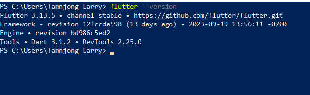

If you see an output similar to the screenshot above then flutter was successfully installed

## 4. Install an IDE
The next step after installing flutter will be to install an Intergrated Development Environment. The most common are Android Studion and Visual Studio Code. I usually prefer installing both.
+ You can download the [latest Visual Studio code release](https://code.visualstudio.com/)


After downloading VS Code the next step will be to install the Dart and Flutter extension. Simple visit the extension tab like on the image above search for flutter and install 

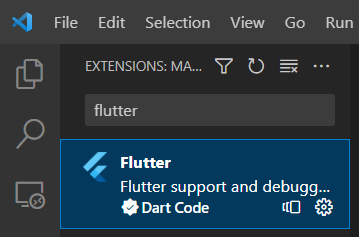

Follow same process to install Dart extension

+ You can download the [latest Android Studio release](https://www.googleadservices.com/pagead/aclk?sa=L&ai=DChcSEwie18r319iBAxXKi2gJHZHFBAMYABAAGgJ3Zg&gclid=Cj0KCQjw1OmoBhDXARIsAAAYGSG3udihx4f1BVV5XeSEabD9HN4T--qKqCQntTVRsxf6RBZEhDRESuUaAqPgEALw_wcB&ohost=www.google.com&cid=CAESVuD26-E7vK7m8Xu5bvm6zQl96aA8U9oToxoNqA8Fds5BbdD5kkEVI7NgsMobYBLxcGEknZktp9AUhaTE5sidytBHB2mYqOO-z32RNYVMqtbvRuAykFTo&sig=AOD64_1VeHsWC0upgYBovHc2v_NBTIeUdw&q&adurl&ved=2ahUKEwiYvcX319iBAxXWU6QEHcHwDC8Q0Qx6BAgGEAE)

The next step After downloading Andriod Studio will be to install the flutter and dart plugin for Android Studio

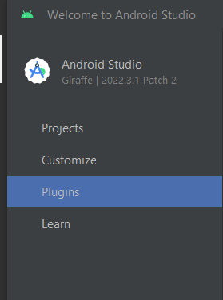

Visit the plugin Tab as on the image above

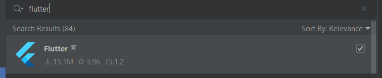

Search for flutter and install 

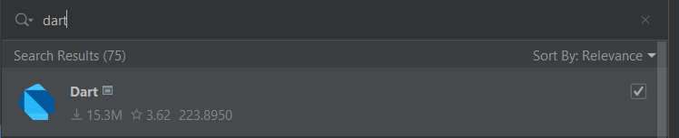

Lastly Search for dart and install

## 5. Clone the "December 2023 to March 2024 Applicants" Repository
To clone the Repository we need to [visit project repository](https://github.com/AnishaSingh0118/Mboacare)
+ The first thing to do will be to click on ``` Fork ``` inorder to create a copy of the code 


After clicking on fork on the repository page the next thing will be to confirm

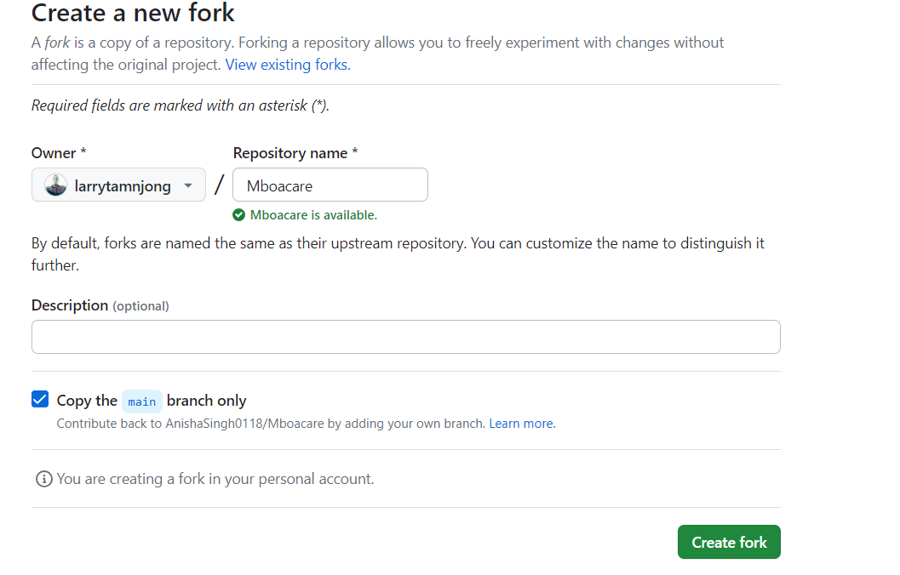

## 6. Clone and Set Up the "Mboacare" Medical App Project
The last thing will be to clone the fork copy of the Mboacare project on our local computer 
+ Open a command prompt on your computer using the ``` cd ``` command you can navigate to a directory where you want to clone the project

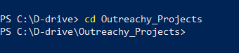

On my computer as on the above image I have navigated to a directory called ```Outreachy_Projects```
+ Now we have to go back to Github and from your profile where you forked the project 

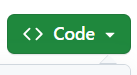

Click the green button


Copy the link to project

+ Now move back to the command prompt and inside you desired directory run this command ``` git clone <Replace with copied linked>``` and press ``` Enter ```

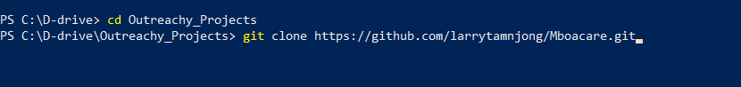

After cloning you should see an output similar to the one below 

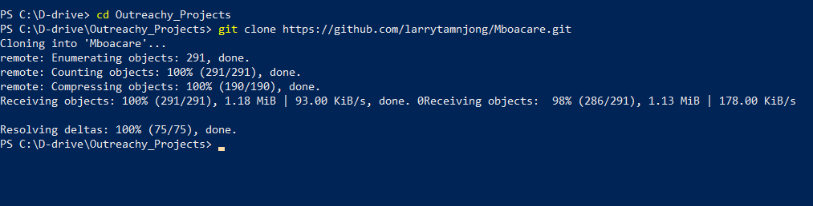

## 7. Open the Project and run the project
+ Go your Desired Editor, In my case I'm using Android Studio

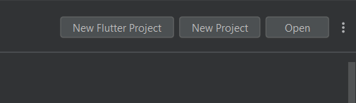

From the tab bar select **Open** and navigate the directory to open the project. 

+ After opening the project several errors will show 


Head to the terminal and run the command ``` flutter pub get ``` to get all dependencies.

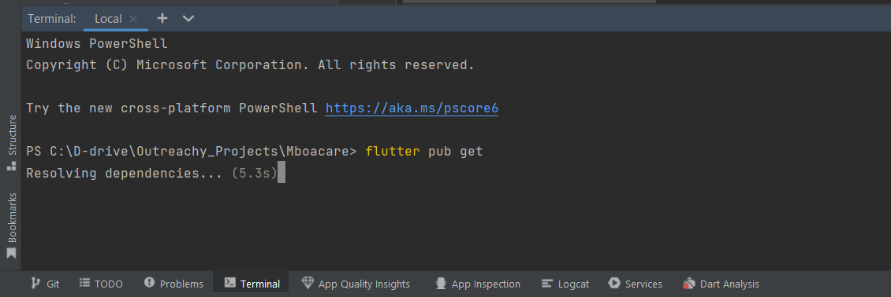

+ We need to select a device from out active devices on Android studio 

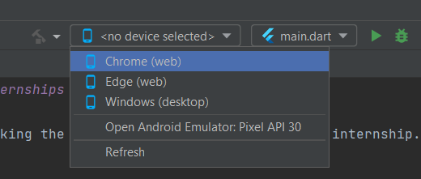

Once you choose your selected device click the play button

If everything runs well you should see this screen on your device 

