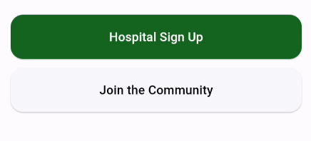
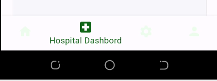
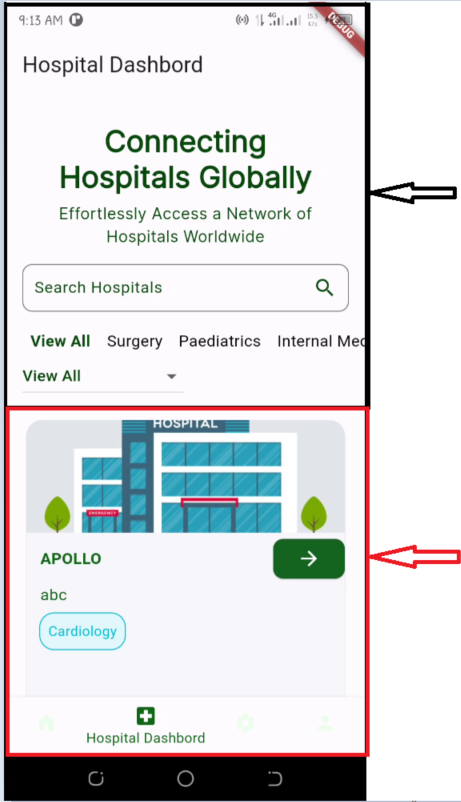
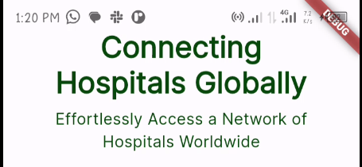
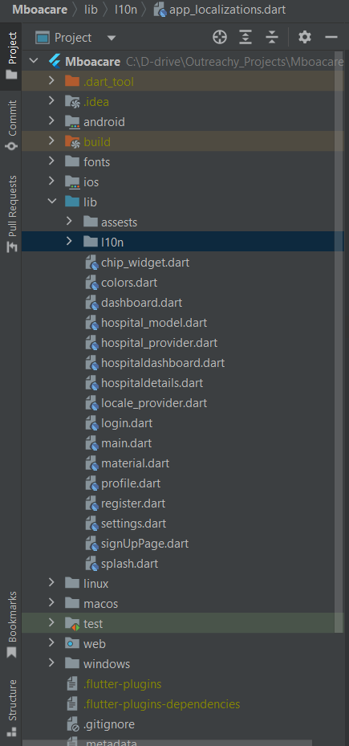

## Please view the running app on my Android Device via this [Link to Google Drive](https://drive.google.com/file/d/1rDldhlrBpxNPc14nd4CFj_ZXYbp23qU5/view)

# Documentation of findings

## Project
The Mboacare Application is an open-source application designed to address a critical problem in healthcare - the lack of easily accessible information about hospital services and locations. This documentation outlines our project's objectives, problem statement, methodology, current features and proposed modifications or updates.

## Problem statement 
In today's age, one of the major challenges in healthcare is the limited availability of information about hospitals' services and their locations. This leads to difficulties for both healthcare professionals and patients in finding the right hospital for specific medical needs. As a result of this information gap, delays occur in finding treatment which leads to increased costs, and even higher mortality rates.

## Objective and methodology of implementation
Mboacare aims to connect hospitals and healthcare facilities to share information and resources effectively. The implementation strategy involves the following:
+ Develop an open-source application for hospitals to register their services and facilities
+ Create a user-friendly interface for both hospitals and patients
+ Enable patients to search for hospitals based on their medical needs and location
+ Enable hospitals to search for other hospitals where they can make referals based on medical needs and location
+ Improve patient care by reducing delays in finding suitable healthcare facilities
+ The Ultimate goal is to reduce mortality rates by facilitating quicker access to appropriate medical care

# Findings and feedback

## Functional sections or components
#### Registration
 Hospital administrators can create accounts by providing personal details and details about their facility, such as location, contact information, services offered, medical specialties, and available facilities.
#### Login
Hospital administrators can log in to their accounts or dashboard.
#### Search
Patients can search for hospitals based on their medical needs and geographical location. They can filter results by factors such as medical specialty, location, and available facilities.

## Non-functional sections and issues found

#### User registration 

The app does not provide the possibility for a regular user to register in the app. It provides just the possibility for Hospital Signup and the option of Joining the LinkedIn community. 

Users at the moment can only use the app as guests I'd recommend enabling the possibility of user registration.




#### Bottom navigation bar


The icon color of the unselected icon buttons at the bottom navigation bar is very pale and challenging to see. Brightening the color will improve navigation ease.
#### Hospital Dashboard page
+ There's a light spelling error instead of ```dashboard``` we have ```dashboard``



+ Secondly, the hospital dashboard screen is divided into two sections, with the fixed header section, indicated with a **black arrow**, occupying an equal portion of the screen alongside the scrollable body section, indicated with a **red arrow**, which contains card widgets displaying individual hospitals.



The layout could be made more efficient by enhancing the flexibility of the header section with the search field. To achieve this, the header section could be wrapped in a sliver app bar. When the user scrolls down, the header section automatically shrinks since, at that point, the user's focus is on scrolling through the available hospitals. Conversely, when the user scrolls up, the header section can expand to occupy slightly more space, providing a more responsive and user-friendly experience.

#### Settings Page

The Settings page is empty and more functionality could be added to this page. Such as
+ Giving the user the ability to switch between light and dark themes
+ Update Language or local (At the moment there's no implementation for local change in the app)
+ View privacy policy and Terms and conditions
+ Reset app preferences

#### Profile Page


The profile page is empty and the logout button does not work and it displays even when the user has not been logged in. 
More functionality could be added to this screen such as:
+ Enabling the functionality to logout for signed-in users
+ Adding functionality to enable users to update their profile details
+ Adding functionality to enable users to delete their accounts 

### Login Screen

After signing into the app, the Hospital Sign-Up page appears (This page requires the user to fill in details about the hospital), regardless of whether the hospital or user is already registered or not. In contrast, the page is supposed to appear only on the first sign-in. 


Additionally, the theming on the page appears a bit inconsistent with the overall app theme, and there isn't sufficient spacing between the widgets. I would suggest making the sign-up page more interactive. Instead of a vertical scroll, each response field could be on a separate page, and the user could click on a **"Next"** button to access the next question. This approach would make the section more engaging and user-friendly.

## Home page after Sign In




+ The text at the top is redundant because it's restating information already displayed on the Sign-In screen. I would suggest removing the text and relocating the search field to the app bar. This way, more space will be available for the hospital display cards and filters.


+ As seen in the video below when the user clicks the back button from the home page, it takes the user back to the Hospital Sign-Up page. The same issue occurs if the user clicks back again; it takes the user to the Sign-In screen, and a third backclick will return the user to the initial load home page.


https://github.com/larrytamnjong/Outreachy-Applicants/assets/122117063/ab40cbd3-5808-4a28-a689-776712d2f188


My suggestion is that, when clicking the back button at that point, the screen is supposed to exit the app. 


## Translation 

Translations in the app do not currently work (A user at the moment cannot switch from one language to another in the app).
## General Suggestion
1. **App structure**



The current app structure as in the image above is simple and good but I believe we could make it better by implementing clean architecture and the MVC pattern to separate the code Business login from the UI so as to be able to easily implement unit testing within the app. With an enhanced structure the app will generallyly perform better, maintaining and debuging would also be easier.

2. **State management**

The provider package is an awesome package that is currently implemented in the app. My personal recommendation is to use GetX due to its 
+ Simplicity and Conciseness easy for everyone
+ Navigation or route management
+ Ease in implementing internationalization (Great for making translations within the app)
+ GetX can help to reduce a lot of boilerplate code
+ GetX can also help in decoupling the view, presentation, and business logic.
