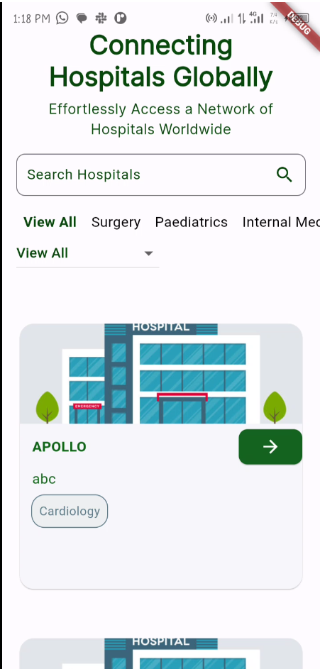
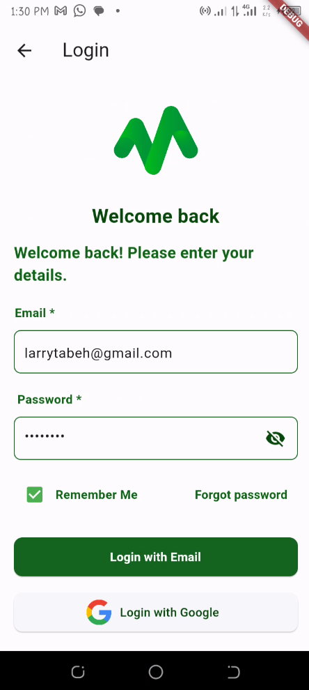

## Please view running app on my Android Device via this [Link to Google Drive](https://drive.google.com/file/d/1rDldhlrBpxNPc14nd4CFj_ZXYbp23qU5/view)

# Documentation of findings

## Project
The Mboacare Application is an open-source application designed to address a critical problem in healthcare - the lack of easily accessible information about hospital services and locations. This documentation outlines our project's objectives, problem statement, methodology, current features and proposed modifications or updates.

## Problem statement 
In today's age, one of the major challenges in healthcare is the limited availability of information about hospitals' services and their locations. This leads to difficulties for both healthcare professionals and patients in finding the right hospital for specific medical needs. As a result of this information gap, delays occur in finding treatment which lead to increased costs,and even higher mortality rates.

## Objective and methodology of implementation
Mboacare aims to connect hospitals and healthcare facilities to share information and resources effectively. The implementation strategy involves the following:
+ Develop an open-source application for hospitals to register their services and facilities
+ Create a user-friendly interface for both hospitals and patients
+ Enable patients to search for hospitals based on their medical needs and location
+ Enable hospitals to search for other hospitals where they can make referals based on medical needs and location
+ Improve patient care by reducing delays in finding suitable healthcare facilities
+ The Ultimate goal is to reduce mortality rates by facilitating quicker access to appropriate medical care

# Findings

## functional sections or components
## User profiles
### 1. Hospistal administrators
#### Registration
 Hospital administrators can create accounts by providing personal details and details about their facility, such as location, contact information, services offered, medical specialties, and available facilities.
#### Login
Hospital administrators can login into their accounts or dashoards.
### 2. Patients (General profile)
#### Search
Patients can search for hospitals based on their medical needs and geographical location. They can filter results by factors such as medical specialty, location and available facilities.

## Non-functional sections and issues found

#### User registration 


The app does not provide the possibility for a regular user to register in the app. It provides just the possibility for Hospital Signup and users have the option of Joining LinkedIn community. 

User at the moment can only use the app as guest I'd recommend enabling the possibility of user registration.

#### Bottom navigation bar


The icon color of the unselected button on the bottom navigation bar is very pale and challenging to see. Brightening the color will improve navigation ease.
#### Hospital Dashboard page
+ There's a light spelling error instead of ```dashboard``` we have ```dashbord```


+ Secondly, the screen is divided into two sections, with the fixed header section, indicated with a **black arrow**, occupying an equal portion of the screen alongside the scrollable body section, indicated with a **red arrow**, which contains card widgets displaying individual hospitals.


The layout could be made more efficient by enhancing the flexibility of the header section with the search field. To achieve this, the header section could be wrapped in a sliver app bar. When the user scrolls down, the header section would automatically shrink since, at that point, the user's focus is on scrolling through the available hospitals. Conversely, when the user scrolls up, the header section can expand to occupy slightly more space, providing a more responsive and user-friendly experience.

#### Settings Page

The Settings page is empty and more functionality could be added to this page. Such as
+ Giving the user the ability to switch between light and dark themes
+ Update Language or local (At the momemt there's no implementation for local change in the app)
+ View privacy policy and Terms and conditions
+ Reset app preferences

#### Profile Page


The profile page is empty and the logout button does not work and shows even when the user has not logged in. 
More functionality could be added to this screen such as:
+ Enabling the functionality to logout for signed in users
+ Adding functionality to enable users update their profile details
+ Adding functionality to enable users delete their accounts 

### Login Screen

After signing into the app, the Hospital Sign-Up page appears, regardless of whether the hospital or user is already registered or not. In contrast, the page is supposed to appear only on the first sign-in. 


Additionally, the theming on the page appears a bit inconsitent with the overall app theme, and there isn't sufficient spacing between the widgets. I would suggest making the sign-up page more interactive. Instead of a vertical scroll, each response field could be on a separate page, and the user could click on a **"Next"** button to access the next question. This approach would make the section more engaging and user-friendly.

## Home page after Sign In




The text at the top is redundant because it's restating information already displayed on the Sign-In screen. I would suggest removing the text and relocating the search field to the app bar. This way, more space will be available for the hospital display cards and filters.

The home page that appears after the user signs in is a bit confusing. Additionally, when the user logs in, they could get stranded on the screen because the bottom navigation bar is not available, and there's no clear or logical next step.


My suggestion could be to put in place a bottom navigation bar or sidebar which will contain options for settings and profile.


In the image above, if the user clicks the back button from the home page, it takes the user back to the Hospital Sign-Up page. My suggestion is that, when clicking the back button at that point, the screen is supposed to exit the app. The same issue occurs if the user clicks back again; it takes the user to the Sign-In screen, and a third back click will return the user to the initial load home page.

 

My suggestion would be to fix the routing so that pages are properly popped.

## General Suggestion
1. App structure 


The current app structure as on the image above is simple and good but I believe we could make it better by implementing clean architecture and the MVC pattern to seperate the Business login from the UI so as to be able to easily expand the codea and implementing testing. With the enhanced structure many people will be able to contribute without much conflicts.

2. State management
The provider package is an awesome package which is currently implemented. My personal recommendation is to use GetX due to its 
+ Simplicity and Conciseness easy for everyone
+ Navigation or route managment
+ Ease in implementing internationalization
+ GetX can help to reduce a lot of biolerplate code
+ GetX can also help in decoupling the view, presentation and business login.
