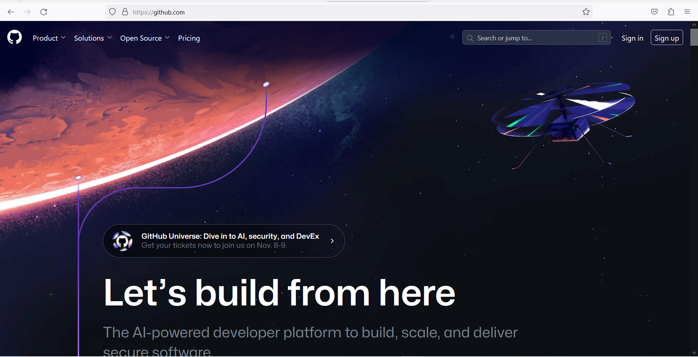
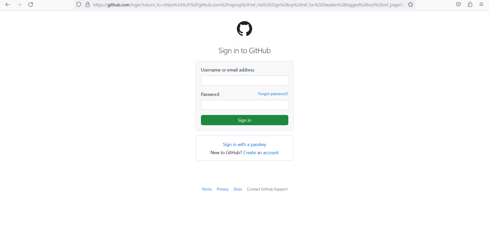
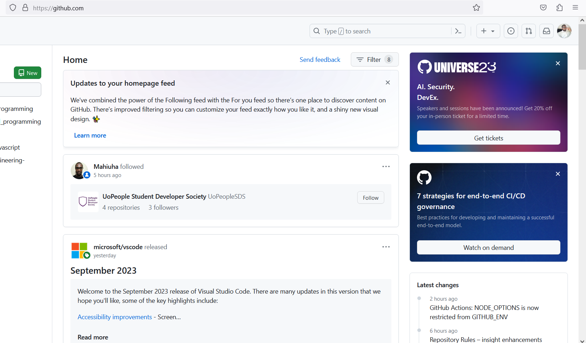
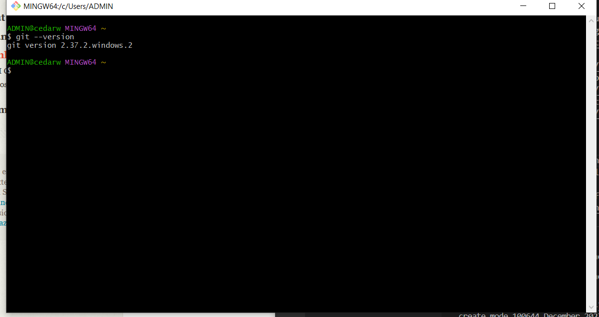
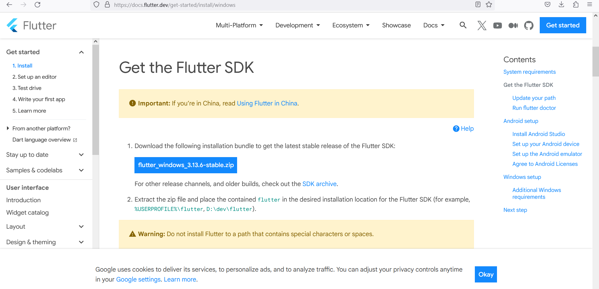
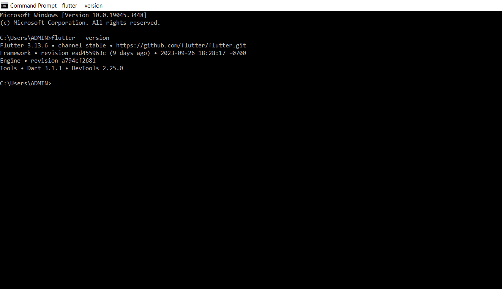
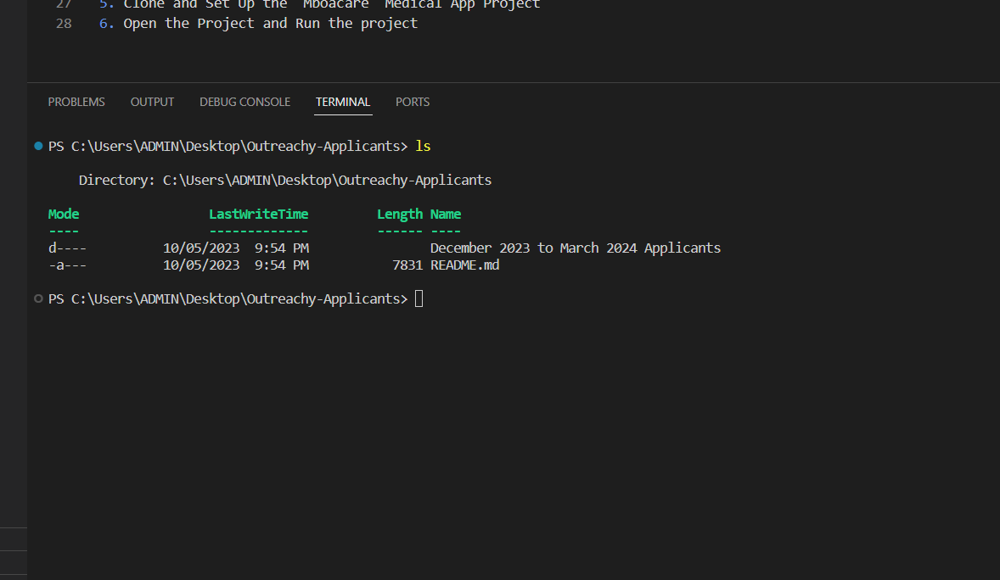
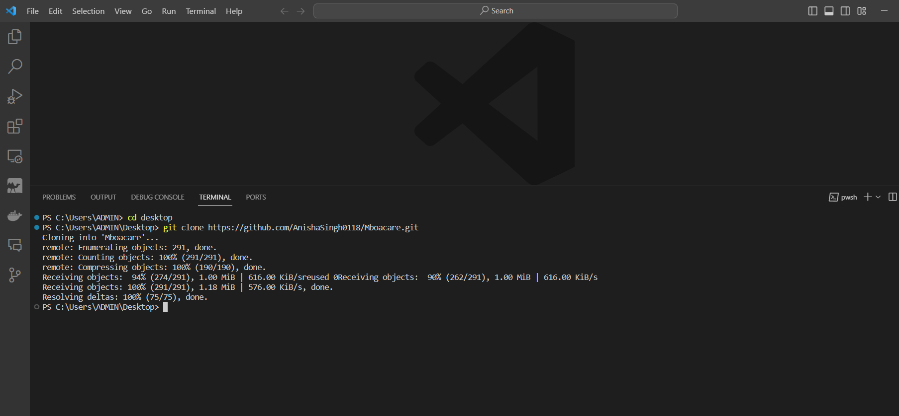
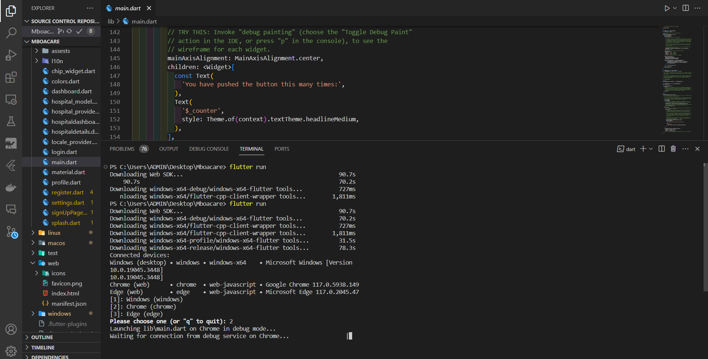

# A step by step guide to setting up development environment for Mboacare App as instructed

- The following are the steps were followed to setup the development environment for Mboacare App on my local machine

## The steps taken for installation and setup on windows 10...

1. Create a github account
    + main steps is to go to the url  and create an account
    -  is a screenshot of github landing page.
    -  then to the sign-in page after signup.
    -  then to home.

2. Git Installation
    - Next step is to install Git. Git is version control tool that helps to track changes to our code files remotely. 
    - Download git for windows here [Git Download url](https://git-scm.com/downloads). It looks like this => 
    - Run the downloaded setup file. 
    - Verify if Git is installed successfully, Open the command prompt/ git bash and run 
    `` git --version `` then press `` Enter `` from your keyboard. it should show like this screenshot 

3. Install  Flutter
    - Flutter is a cross platform UI framework on which Mboacare is built hence, to run Mboacare development environment we need to setup the flutter development environment
    - There is a simple guide provided to install flutter [flutter SDK installation](https://docs.flutter.dev/get-started/install) It does look like this screenshot 
    - After the installation, You can verify the version by opening a command prompt on windows and type `` flutter --version ``
    

4. Clone the "December 2023 to March 2024 Applicants" Repository  

5. Clone and Set Up the "Mboacare" Medical App Project 

6. Open the Project and Run the project 