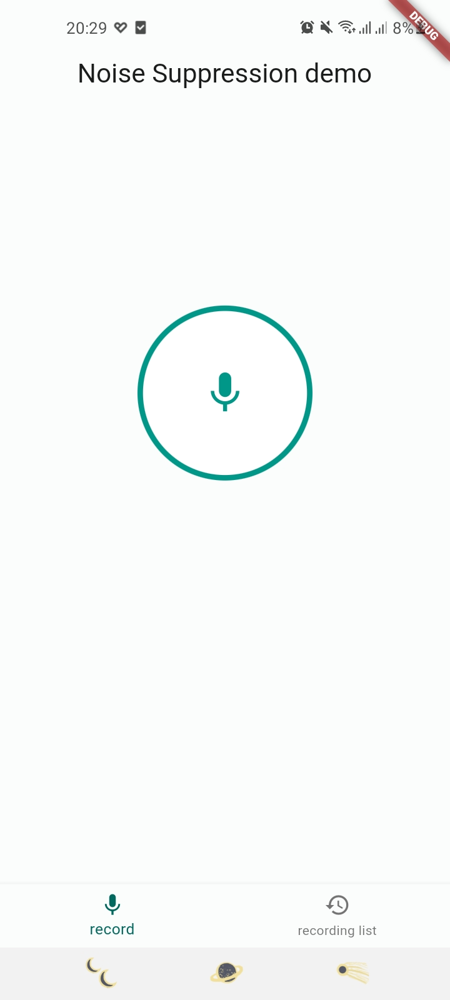
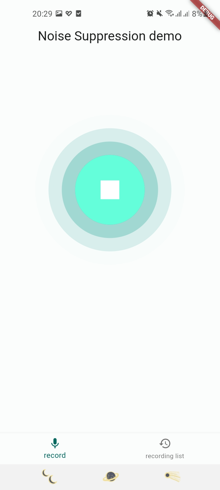
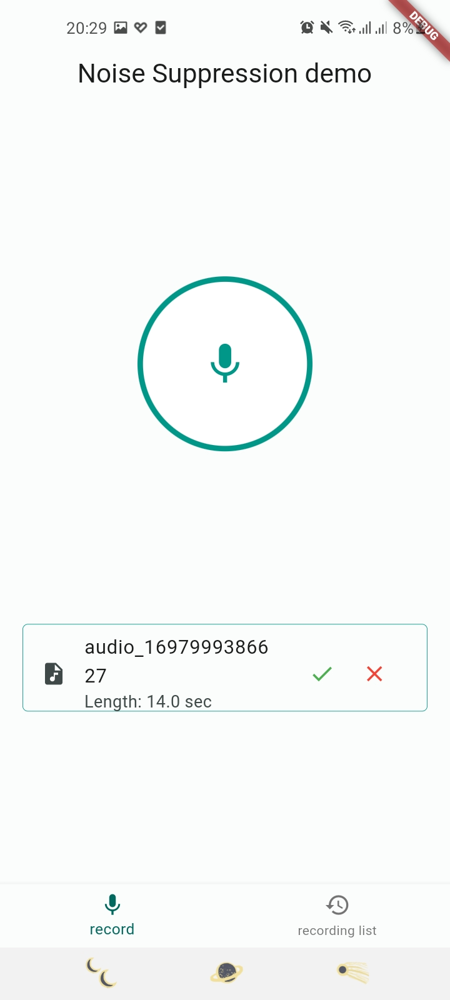
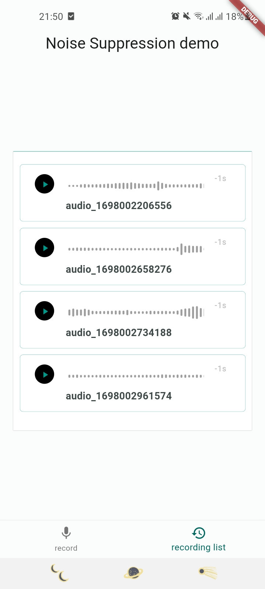

# RESEARCH TASK

## Theory of noise reduction in audio processing

### Introduction

 Audio processing refers to the manipulation and modification of audio signals using various techniques and algorithms. It involves analyzing, enhancing, or altering audio data to achieve specific objectives or improve the quality of the sound. This audio processing  improves the accuracy of speech recognition models by providing cleaner input. This research will explore more on noise reduction.

### 1. noise reduction

 Noise reduction techniques aim to remove or reduce unwanted background noise from an audio signal. This is particularly useful in applications such as speech recognition, music production, and telecommunication systems.

#### Common noise reduction algorithms

 1. **Wiener Filtering**
 The Wiener filter is a widely used algorithm for noise reduction. It estimates the clean speech signal by minimizing the mean square error between the observed noisy signal and the estimated clean signal. The Wiener filter takes into account the statistical properties of the noise and the speech signal to achieve noise reduction.

 2. **Spectral Subtraction**
 This algorithm estimates the noise spectrum from a non-voiced section of the signal and then subtracts it from the signal spectrum. This is a simple and effective algorithm for reducing white noise and other stationary noise. This method consists of computing the spectrum of the noisy speech using the Fast Fourier Transform (FFT) and subtracting the average magnitude of the noise spectrum from the noisy speech spectrum.

3. **Kalman Filter**
The Kalman filter is a nonstationary, recursive filter that allows estimation of the
useful signal in noisy time series in each moment of time. In steady state Kalman
approach to digital filtering signal ```{xk }``` is described by two linear difference stochastic
equations. Kalman filter is popular for having easy computation, memory requirements and good capability
on overcoming noises. It is state technique estimation that can extract information from noisy data. Hence, Kalman Filter is best to use for general noise reducer on sensor-reading, especially when
the information of noise’s frequency that may happen to the sensor-reading is unavailable.

## flutter libraries for noise reduction

### Comparison of flutter noise reduction libraries

The following libraries can process audio files or streams in such a way that they can manipulate frequency, sampling rate, metering, and perform noise reduction on audio files or streams.

| Library                          | Documentation | Popularity | Compatibility | Noise Reduction | Support | Updates | Reviews | Algorithm used | Total Score |
|----------------------------------|---------------|------------|---------------|-----------------|---------|---------|---------|----------------|--------------|
| noise_meter                      | 8             | 6          | 9             | N/A             | 7       | 8       | 7       | FFT            | 52           |
| flutter_coast_audio_miniaudio    | 4           | 6         | 7             | YES             | 7       | 8       | 4       | FFT            |     50       |
| audio_streamer                   | 8             | 6          | 7             | N/A              | 7       | 6       | 5       |  N/A             | 52           |
| Just_audio                       | 7             | 6          | 7             | N/A               | 8       | 6       | 7      | N/A              |     53        |
| record                    | 9             | 8          | 8             | YES             | 8       | 9       | 8       | N/A            | 60           |
| flutter_sound                    | 7             | 7          | 7             | N/A             | 7       | 7       | 9       | N/A            | 57          |


### table interpretation

|          |                                            |
|------------------|------------------------------------------------------------|
| Documentation    | Score representing the quality and comprehensiveness of the library's documentation               |
| Popularity       | Score indicating the popularity or usage of the library among developers  based on pub.dev                                        |
| Compatibility    | Score reflecting the level of compatibility of the library on diffrent platiforms      |
| Noise Reduction  | Indicates whether the library supports noise reduction feature (YES/NO)                                          |
| Support          | Score representing the level of support provided for the library, such as community or official support   |
| Updates          | Score indicating the frequency and consistency of updates and new releases for the library                   |
| Reviews          | Score based on user reviews or feedback for the library based on github interactions                                                     |
| Algorithm used   | The algorithm utilized by the library for audio processing                                                    |
| Total Score      | The overall score calculated based on the individual scores of different aspects of the library               |


**FFT** refers to  Fast Fourier Transform, which is an algorithm used to efficiently compute the Discrete Fourier Transform (DFT) of a sequence or signal.

### Others ways to implement noise reduction in flutter apps.

1. **Using native plugins**: Platform-specific integrations, can leverage the native audio processing capabilities of the underlying platforms (iOS and Android). This involves writing platform-specific code in Objective-C/Swift (for iOS) or Java/Kotlin (for Android) to implement noise reduction. These  can be done with help of  ```FFI```  library.
   
2. **Remote API services**: Can utilize external API services that provide noise reduction algorithms and integrate them into your Flutter project. For example, you can use Fisky api.

## Implementing noise reduction/ cancellation in audio recording with [```record```](https://pub.dev/packages/record) library

Flutter [```record```](https://pub.dev/packages/record) third party library supports noise reduction out of the box.<br/>
To implement  [```record```](https://pub.dev/packages/record)  library  to process audio recordings and cancel out background noise while preserving the heart and lung sounds, involves following these steps:<br/>
**[To setup flutter development enviroment](https://docs.flutter.dev/get-started/install)**
1. Create a new Flutter project:
    ```
    flutter create audio_rec_demo
    ```

2. Open the project folder:
    ```
    cd audio_rec_demo
    ```

3. Open the `pubspec.yaml` file in your project directory.

4. Add the `flutter_sound` library as a dependency by adding the following line under the `dependencies` section:
    ```yaml
    dependencies:
      flutter:
        sdk: flutter
      record: ^5.0.1
    ```

5. Save the `pubspec.yaml` file.

6. Run the following command to fetch and install the dependencies:
    ```
    flutter pub get
    ```

7. To utilize the `record` library for noise cancellation project code snippet:
  ```
  import 'package:record/record.dart';
  ---
    Future<void> _start() async {
    try {
      if (await _audioRecorder.hasPermission()) {

        ---
        const config = RecordConfig(
          encoder: encoder,
          noiseSuppress: true,
          echoCancel: true
          );

        await recordFile(_audioRecorder, config);
        _recordDuration = 0;

        _startTimer();

      }
    } catch (e) {
     ---
     ---
    }
  }
  ```
**Other libraries**

Other libraries like [```flutter_coast_audio_miniaudio```](https://pub.dev/packages/flutter_coast_audio_miniaudio) can also perform noise reduction theoretically since it supports Low Pass filter. Applying a low-pass filter to the audio signal can attenuate high-frequency noise components.

## Implementing a storage mechanism to save the recorded heart and lung sounds.

To implement a storage mechanism for saving recorded heart and lung sounds within a Flutter app, you can utilize a combination of local file storage/system and database approach.

**Libraries:** <br/>
File system - [```path_provider```](https://pub.dev/packages/path_provider) <br/>
Database - [``` sqflite ```](https://pub.dev/packages/sqflite) <br />

The mechanism should save files in the local file system and use a Flutter database to reference those stored file.

1. **Saving Files in the Local File System**:
Use the path_provider package to get the local directory path where you can save files.
Convert the recorded audio into a suitable format (e.g., WAV, MP3) using an audio encoding library like flutter_sound or audioplayers.
Generate a unique filename for each recorded audio file, such as appending a timestamp or using a randomly generated ID.
Save the audio file to the local file system using the dart:io library's File class and the obtained directory path.
```
import 'dart:io';
import 'package:path_provider/path_provider.dart';

Future<File> saveAudioFileToLocalStorage(File audioFile) async {
  final directory = await getApplicationDocumentsDirectory();
  final fileName = 'audio_${DateTime.now().millisecondsSinceEpoch}.wav';
  final savedFile = await audioFile.copy('${directory.path}/$fileName');
  return savedFile;
}
```
2. **Adding database Integration**

The mechanism uses [```sqflite```]() database to store file data.


| Field     | Type     | Description                               |
|-----------|----------|-------------------------------------------|
| id        | String   | Unique identifier of the recording.        |
| pathname  | String   | Path of the memory location where the file is stored. |
| filename  | String   | Name of the recording.                     |
| dateTime  | DateTime | Date and time of the recording.            |

```
Future<int> saveAudioFileMetadata(Database database, String pathname ,String filename  , String timestamp, int duration) async {
  final Map<String, dynamic> row = {
    'pathname': pathname,
    'filename': filename,
    'dateTime': dateTime
  };

  return await database.insert('audio_files', row);
}
```

## Full app demo

This demo used  lung sounds  from [mometrix](https://www.mometrix.com/academy/lung-sounds/)   when recording demo video and also for testing the efficiency of different libraries when evaluating libraries.

The following are screenshots noise suppresion and  storage mechanism to save the recorded heart and lung sounds demo app:

<p align="center">
   &nbsp; | &nbsp;
   &nbsp; | &nbsp;
   &nbsp; | &nbsp;
   &nbsp; | &nbsp;
</p>

### View demo video [here](https://drive.google.com/file/d/1_u93khVpFrJhCPWf-DMBWpVzUYOBjok2/view?usp=drivesdk)

Thank you for reading this far. I hope this research  shed light on noise reduction techniques and also flutter noise reduction libraries.