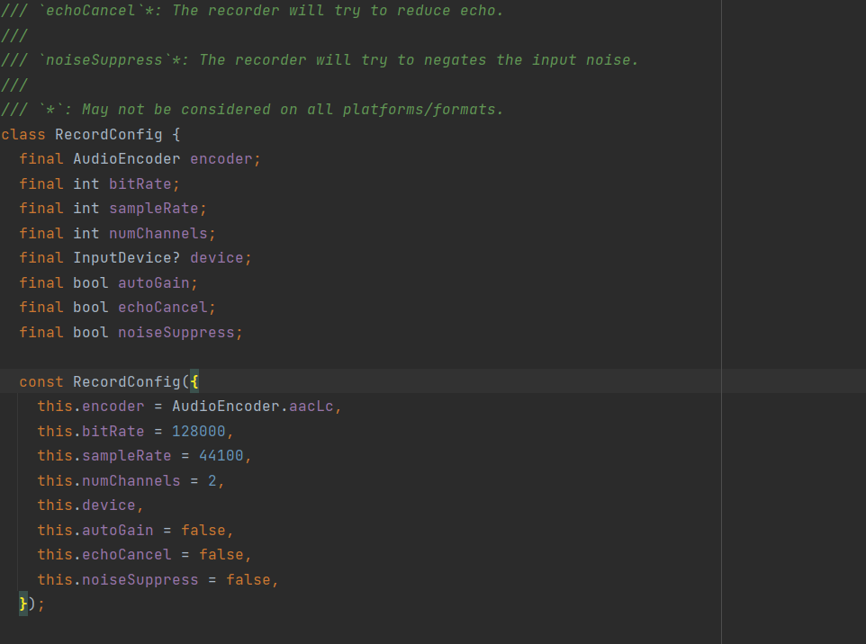
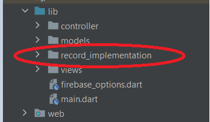
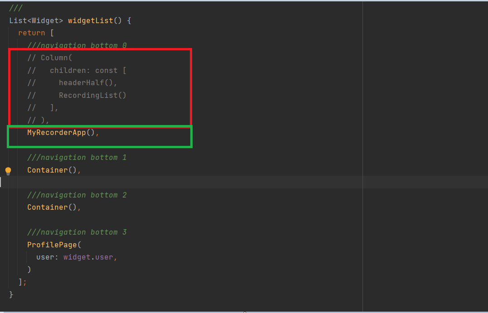
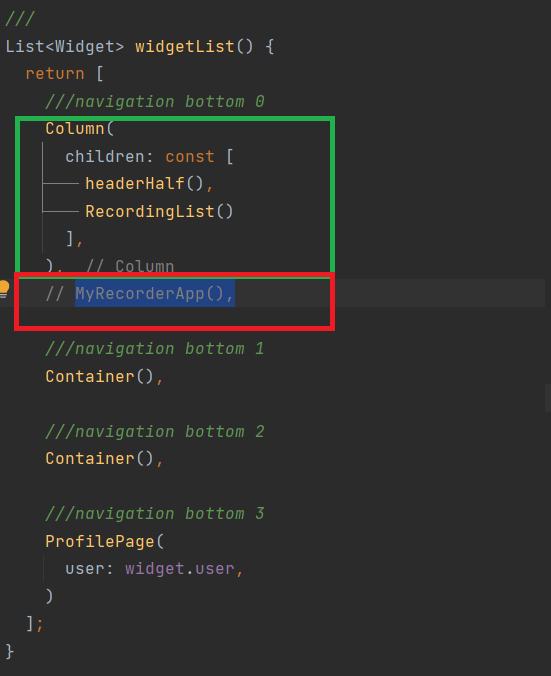
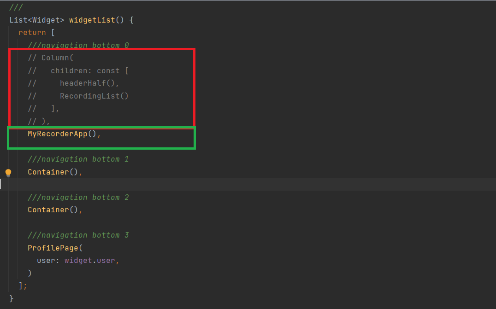

## Noise Reduction In Audio Recordings for Heart and Lung Analysis

Noise reduction in audio recordings is important as it allows us to be able to extract valuable information and avoid distractions from the core message of the recording. In the case of the Mboathoscope app, this involves eliminating or reducing background noise from heart and lung sound recordings to make them audible and clear enough for further analysis.

## Research

In my research to identify a suitable audio processing technique or Flutter libraries for noise reduction in audio recordings, I found that audio can be processed either during the audio recording process or after it has been recorded.

Both approaches to processing audio have their advantages, but my personal preference and focus is on the first approach. Processing an audio recording and removing noise during the recording process. I favor this approach for several reasons: 

+ It saves time, eliminating the need to record audio separately and then process it later.
+ Since only the cleaned audio data is saved, this approach results in more efficient data storage, thereby reducing the need for post-processing and storage requirements.
+ Processing audio during the recording process ensures that the original audio quality is maintained, as noise reduction is applied without the need for compression or data transformation as is the case with post-processing.

### Flutter Libraries for Simultaneous Audio Recording and Noise Reduction 

Flutter provides a variety of libraries for audio recording. In this stage of the research, my objective was to identify a suitable Flutter library that enables both audio recording and simultaneous noise reduction processing.

In my research, I came across a couple of audio recording libraries which include: 

+ [Flutter audio recorder2](https://pub.dev/packages/flutter_audio_recorder2)
+ [Another audio recorder](https://pub.dev/packages/another_audio_recorder)
+ [Fancy audio recorder](https://pub.dev/packages/fancy_audio_recorder)
+ [Record](https://pub.dev/packages/record)
+ [Mc flutter recorder](https://pub.dev/packages/mc_flutter_recorder)
+ [Audio waveforms](https://pub.dev/packages/audio_waveforms) which is currently implemented in the Mboathoscope app


After a complete and detailed analysis of the above libraries, considering their properties, functionalities, and implementation, I found that the [Record](https://pub.dev/packages/record) library is the only option that supports simultaneous audio recording and noise reduction. The [Record](https://pub.dev/packages/record) library offers built-in noise and echo reduction features, making it a convenient and user-friendly choice for implementation.




The image above displays the ```RecordConfig``` class provided by the library. This class comprises properties that facilitate the straightforward application of noise and echo reduction. A developer can achieve noise suppression or echo cancelation simply by toggling the properties for **noiseSuppress or echoCancel** to **true or false**.

### Implementation

The Mboathoscope app currently implements the [Audio waveforms](https://pub.dev/packages/audio_waveforms) library to record and store audio locally in the app. My goal at this stage is to show the effectiveness of the record library.

1. I created a folder in the lib directory called  record_implementation 



2. In the record_implementation folder I implemented the code for the (record library)[https://github.com/llfbandit/record/tree/master/record/example] 
3. The record library has a different implementation structure from the audio waveforms library. Hence I created a separate implementation so you can easily compare both libraries by commenting out a few lines of code in the ```HomePage.dart``` file




### Output without record library




https://github.com/larrytamnjong/Outreachy-Applicants/assets/122117063/30235c85-62fb-44d8-8c36-b979b3ea9a46


### Output with record library




https://github.com/larrytamnjong/Outreachy-Applicants/assets/122117063/f8f379f2-6559-4079-a0ba-b6c98925803c


### The audios are recordings of my own heart sounds recorded with my Android phone (Techo Spark 8 with an Android 11 OS). Please feel free to use headphones for better audio clarity. Lastly, my phone's microphone is not of very high quality, but you can still clearly hear a noticeable difference in audibility between the implementations, with the "record" library significantly better.
